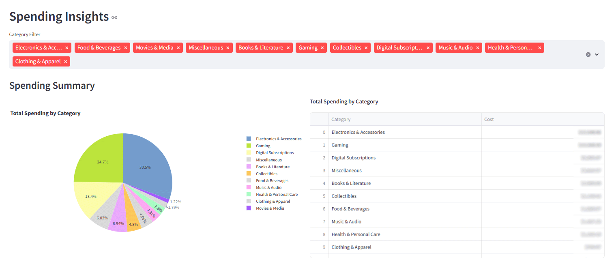

# Budgeting Dashboard

A PySide6 (Qt) desktop application for tracking, analyzing, and visualizing personal spending data. This app loads purchase records from a structured `.xlsx` file, provides interactive filtering and plotting, and includes tools for data maintenance.



## Features

- **Desktop Application (PySide6/Qt)**

  - **Dashboard**: Single-page interface with KPIs, trend analysis, and interactive visualizations
  - **Time-based Filtering**: View Last 12 months, specific years, or all data
  - **Data Management**: One-click XLSX remake functionality with automatic backup and sorting

- **Interactive Visualization (matplotlib)**

  - Monthly trend charts with 3-month rolling averages
  - Cumulative spending chart showing day-by-day total growth
  - Category pie charts and spending distribution by transaction size
  - Top items bar charts with category-colored segments and hover tooltips
  - Month-specific breakdowns with charts for individual months

- **Excel File Handling (openpyxl)**

  - Automated XLSX reformatting with `remake_xlsx_file()` function
  - Applies conditional formatting and data validation
  - Sorts records by date and initializes missing columns
  - Creates timestamped backups before modifications

## Folder Structure

```plaintext
src/
├── qt_app.py               # Main application entry point (PySide6)
├── pages/
│   └── dashboard.py        # Dashboard page: plots, KPIs, controls
├── utils/
│   ├── category_colors.py  # Category color palette helpers
│   ├── data_loader.py      # Load & preprocess XLSX data
│   ├── path_helpers.py     # Path resolution helpers (packaging-aware)
│   ├── plots.py            # Matplotlib plotting helper functions
│   ├── xlsx_formats.py     # Excel formatting & validation helpers
│   └── xlsx_handler.py     # Excel read/write and `remake_xlsx_file` logic
```

## Installation & Usage

### Running from Source

1. Clone the repository:

   ```powershell
   git clone https://github.com/dragonstonehafiz/budgeting-analysis.git
   cd budgeting-analysis
   ```

2. Create and activate a virtual environment (recommended):

   ```powershell
   python -m venv venv
   venv\Scripts\activate
   ```

3. Install dependencies:

   ```powershell
   pip install -r requirements.txt
   ```

4. Prepare your Excel file:

   - Place your `purchases.xlsx` file inside the `data/` directory
   - The app includes a "Remake purchases.xlsx" button on the Dashboard to automatically format and sort the file

5. Run the Qt desktop app:

   ```powershell
   python src/qt_app.py
   ```

### Building an Executable

1. Install PyInstaller:

   ```powershell
   pip install pyinstaller
   ```

2. Build the executable:

   ```powershell
   pyinstaller --noconfirm --clean --name "BudgetingApp" --onefile --windowed src/qt_app.py
   ```


## Expected purchases.xlsx Structure

The app expects the purchase data to be in the following format:

| Column Name | Type       | Description                                                       |
| ----------- | ---------- | ----------------------------------------------------------------- |
| `Item`      | `str`      | Name or description of the purchased item.                        |
| `Category`  | `str`      | Spending category. Should match one of the predefined categories. |
| `Cost`      | `float`    | Purchase amount in dollars.                                       |
| `Date`      | `datetime` | Date of purchase (formatted as `dd/mm/yyyy`).                     |
| `Month`     | `str`      | Auto-generated month name (e.g., `January`, `February`).          |
| `MonthNum`  | `int`      | Auto-generated month number (1–12).                               |
| `Year`      | `str`      | Auto-generated year (e.g., `2025`).                               |

- Columns `Month`, `MonthNum`, and `Year` are **automatically filled** based on the `Date` field if missing.
- `Category` can be manually entered or validated using a dropdown (provided by the Excel formatting scripts).
- Date must be a proper Excel Date value, not plain text.

Example:

| Item             | Category              | Cost   | Date       | Month    | MonthNum | Year |
| ---------------- | --------------------- | ------ | ---------- | -------- | -------- | ---- |
| Netflix          | Digital Subscriptions | 19.99  | 01/01/2025 | January  | 1        | 2025 |
| Nintendo Switch  | Gaming                | 299.99 | 05/01/2025 | January  | 1        | 2025 |
| McDonald's Lunch | Food & Beverages      | 8.50   | 12/02/2025 | February | 2        | 2025 |

## Requirements

- Python 3.9 or newer
- Windows (tested), Linux/macOS (should work but not tested)

## Key Features in Detail

- **Dashboard Page**: 
  - **Year Selector**: View Last 12 months (complete calendar months), specific years (sorted newest first), or all data
  - **Search Functionality**: Filter purchases by item name or notes
  - **Chart Options**: Switch between monthly trends, 3-month rolling average, or cumulative spending
  - **Statistics Panel**: 13 KPIs including total spent, averages, quartiles, and spending volatility
  - **Overall Data Section**: 
    - Selectable trend charts (monthly/rolling/cumulative)
    - Top 10 most expensive items table
    - Category distribution and amount quartile pie charts
    - Top items bar chart with category-colored segments
  - **Monthly Details** (when specific year selected):
    - 12-month spending pie chart
    - Month selector with detailed items table
    - Category breakdown for selected month
    - Top items chart for selected month
  - **Category Section**:
    - Automatic selection of highest-spend category
    - Category-specific top items chart and table
  - **Interactive Features**:
    - Hover tooltips showing item details and notes
    - Category-colored visualizations for easy identification
    - Responsive charts that adapt to data range

- **Data Management**:
  - One-click XLSX remake with confirmation dialog
  - Automatic backup creation with timestamps
  - Sorts data by purchase date (oldest to newest)
  - Applies Excel data validation and conditional formatting

## Notes

- The app operates on **local files only** - no external database or network access required
- Built for offline use with your personal financial data
- The executable automatically detects whether to use a sibling `data/` folder (when built) or the repository `data/` folder (when running from source)
- Excel file modifications create timestamped backups in the same folder for safety

